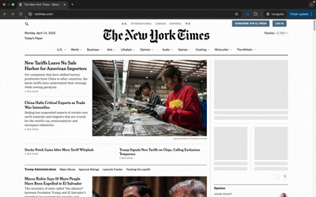

## Education Purpose Disclaimer
> This Chrome extension is developed solely for educational purposes. 
> The Developer bears absolutely no responsibility and liability for any misuse, unauthorized use, or unlawful application of this extension by any party.
> Users assume full responsibility for ensuring their use complies with all applicable laws, terms of service, and website policies.

----
Extension to access paywalled news contents via archive.today (also submit a web page to archive to archive.today)
Now, it also supports Medium via freedium

----
### Manual Setup Instructions:
There are two ways to install the extension manually, cloning the repo, downloading the zipped ```.zip``` or the ``.crx`` file from the GitHub Releases page.

To use any of these methods please 
1. Go to ```chrome://extensions/```
2. Turn ON "Developer Mode" (In Google Chrome; it's a toggle on the top right corner)

#### Using the Zip File (<span style="color: Green">Recommended</span>)
1. Enable the "Developer Mode"
2. [Download](https://github.com/akhanal47/archive-web-page/releases) and save ```archive-web-page.zip``` file then unzip it to your desired location.
3. Select "Load Unpacked" button & select the folder where you unzipped the extension files.

#### Cloing the Repo
1. Clone the repo using ```git clone https://github.com/akhanal47/archive-web-page```
1. Enable the "Developer Mode"
2. Select "Load Unpacked" button & select the folder where the repo is cloned

----
### Usage Example
Watch the demo usage 

 

----
#### To Do:
- [x] Add option to search a link from the context menu
- [ ] Allow user to dictate tab behaviours
- [ ] Add option to allow user preference, such as new tab active, new tab placement etc.. (as it is on the original extension)


